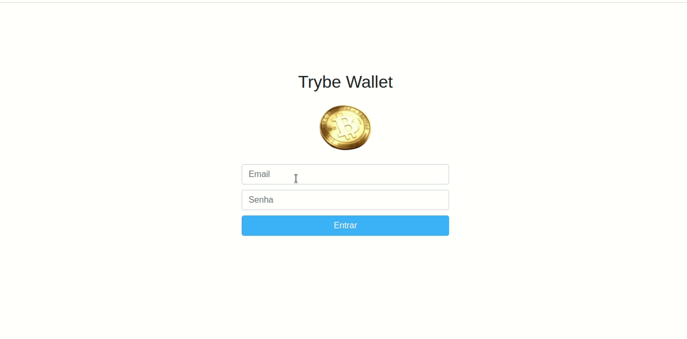
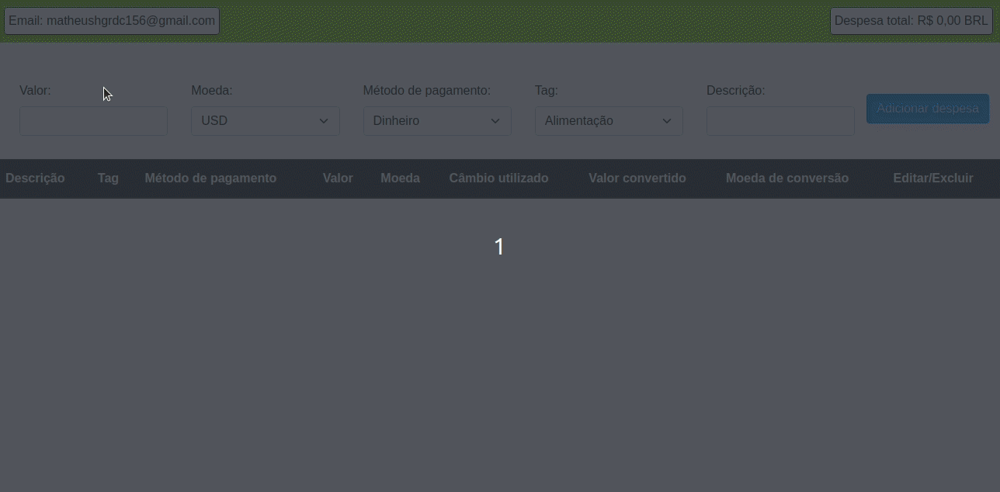

# Projeto Trybe Wallet!

Esse projeto foi desenvolvido no curso de Desenvolvimento de Software Web da Trybe. Neste projeto foi desenvolvida uma carteira de controle de gastos com conversor de moedas, ao utilizar essa aplicação um usuário deverá ser capaz de:
  - Adicionar e remover um gasto;
  - Visualizar uma tabelas com seus gastos;
  - Visualizar o total de gastos convertidos para uma moeda de escolha;

<div>
  
  
</div>

---

# Tecnologias usadas

Neste projeto, utilizei as seguintes tecnologias:

  * Store Redux do React
  * Reducers no Redux
  * Actions no Redux
  * Dispatchers no Redux
  * Actions assíncronas com Redux Thunk.

---

# Instruções para rodar o projeto no seu computador:

## Antes de começar a desenvolver

1. Clone o repositório
  * `git clone git@github.com:Matheushg156/project-trybewallet.git`
  * Entre na pasta do repositório que você acabou de clonar:
    * `cd sd-014-b-project-trybewallet`

2. Instale as dependências e inicialize o projeto
  * Instale as dependências:
    * `npm install`
  * Inicialize o projeto:
    * `npm start` (uma nova página deve abrir no seu navegador com um texto simples)
  
---

## Documentação da API de Cotações de Moedas

Essa aplicação irá consumir os dados da API do _awesomeapi API de Cotações_ para realizar a busca de câmbio de moedas. Para realizar essas buscas, foi consultado o seguinte _endpoint_:

- https://economia.awesomeapi.com.br/json/all

O retorno desse endpoint será algo no formato:
```
{
   {
     "USD": {
       "code":"USD",
       "codein":"BRL",
       "name":"Dólar Comercial",
       "high":"5.6689",
       "low":"5.6071",
       "varBid":"-0.0166",
       "pctChange":"-0.29",
       "bid":"5.6173",
       "ask":"5.6183",
       "timestamp":"1601476370",
       "create_date":"2020-09-30 11:32:53"
       },
      ...
   }
}
```

Se você quiser aprender mais informações sobre a API, veja a [documentação](https://docs.awesomeapi.com.br/api-de-moedas).

---
